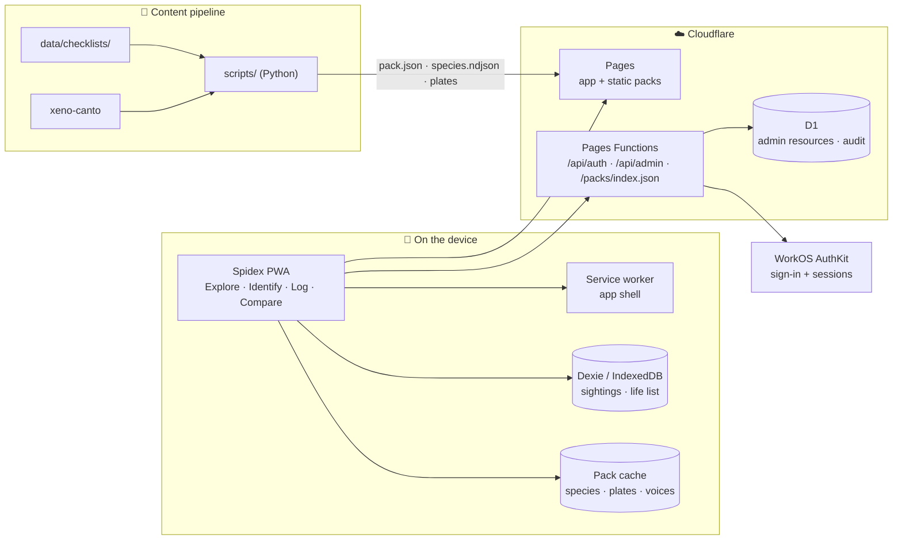

<div align="center">
  

  # Spidex

  **The field guide that works where the field is — offline.**

  Spot a bird in the canopy, a butterfly on the trail. Identify it, log it,
  grow your life list. Spidex packs the species of Vietnam and Southeast Asia
  onto your phone so the guide keeps working with zero signal.

  [](https://github.com/hanh090/spidex/actions/workflows/ci.yml)
  [](https://react.dev)
  [](https://www.typescriptlang.org)
  [](https://vite.dev)
  [](https://pages.cloudflare.com)
  [](https://web.dev/progressive-web-apps/)
</div>

---

## ✨ Features

- 🔭 **Explore** — browsable species catalogue from downloadable packs
  (Vietnam · Thailand · Malaysia, birds and butterflies)
- 🧬 **Identify** — trait-based filtering narrows a sighting down to a species
- 📓 **Sightings** — personal field log with photos and life list, stored on-device
- ⚖️ **Compare** — side-by-side species comparison
- 📦 **Packs** — offline species packs with hand-drawn archetype plates and
  bird voices from xeno-canto
- 🛠 **Admin console** — `/admin`, a D1-backed resource store gated by `ADMIN_EMAILS`
- 🌐 **i18n** — English, Vietnamese, German
- 📲 **PWA** — installable, service-worker precache, designed for the field

## 🧭 How it works



The app shell precaches on install; species packs download on demand into
their own cache, so a pack never rots mid-trip and content updates never swap
out from under you in the field.

## 🚀 Quick start

```bash
npm install
npm run dev         # vite dev server
npm test            # vitest
npm run typecheck   # tsc -b --noEmit
npm run build       # → dist/
```

Copy `.env.example` → `.env` and fill in:

| Variable | Purpose |
|---|---|
| `WORKOS_CLIENT_ID` / `WORKOS_API_KEY` | AuthKit sign-in |
| `WORKOS_REDIRECT_URI` | OAuth callback (`/auth/callback`) |
| `SESSION_SECRET` | Session signing (falls back to the API key) |
| `ADMIN_EMAILS` | Comma-separated admins for `/admin` — fails closed when unset |
| `XENO_CANTO_API_KEY` | Bird-voice pipeline (`scripts/fetch_bird_voices.py`) |

## 🔄 CI/CD

`.github/workflows/ci.yml` runs **typecheck → tests → production build** on
every PR and push to `master`. Merges to `master` deploy `dist/` to Cloudflare
Pages. Required repo secrets: `CLOUDFLARE_API_TOKEN`, `CLOUDFLARE_ACCOUNT_ID`.
Manual deploy: `npm run deploy`.

One-time D1 setup:

```bash
wrangler d1 execute spidex-admin --file=migrations/0001_admin.sql --remote
```

## 🗃 Data pipeline

`scripts/` (Python) compiles source checklists (`data/checklists/`) into pack
files (`public/packs/*/species.ndjson`), generates the archetype SVG plates,
and fetches bird voices. Pack photography is bulk content and stays out of
git — see `.gitignore`.

## 📁 Layout

```
src/            app code (screens, features, data layer, i18n, ui)
functions/      Cloudflare Pages Functions (auth, admin API, pack index)
public/packs/   species packs (ndjson + archetype plates)
data/           source checklists, voices, manifests
scripts/        pack/content pipeline (Python)
migrations/     D1 schema
docs/           source checklist notes
design/         logo and design sources
```

---

<div align="center">
  <sub>Built for the field. 🦋</sub>
</div>
