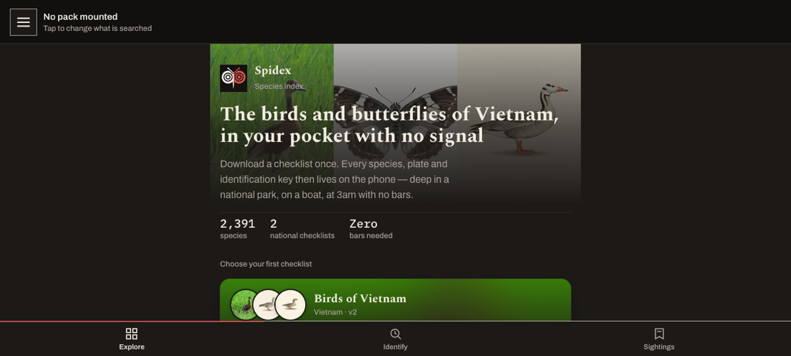
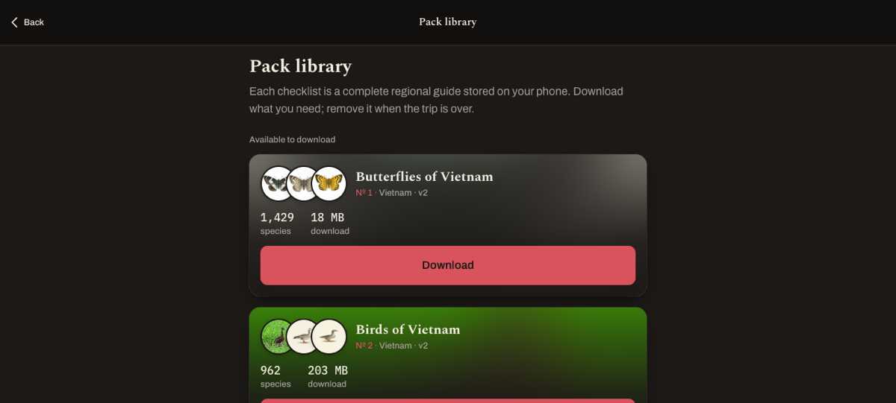
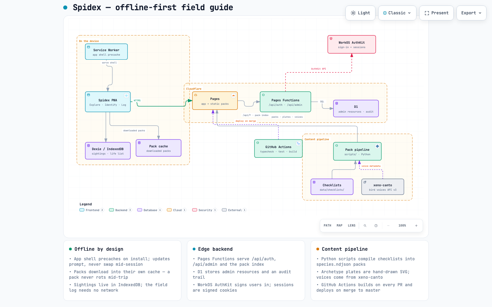

<div align="center">


# Spidex

**A field guide for the places with no signal.**

An open catalogue of species packs — any taxon, any region, authored by
anyone — with species accounts, identification keys, and voice recordings
that live entirely on your phone.

[](https://github.com/hanh090/spidex/actions/workflows/ci.yml)
[](https://spidex-app.pages.dev)
[](https://spidex-app.pages.dev)

**[Open the app →](https://spidex-app.pages.dev)**

</div>

---

Field guides fail where they're needed most: deep in a national park, on a
boat, at 3am with no bars. Spidex is a species index designed the other way
around — a checklist downloads once, then every species, plate and
identification key works with **zero connectivity**.

<div align="center">

| | |
|---|---|
|  |  |
| *Download once. Everything lives on the device.* | *Each pack is a complete regional guide — specimens, keys, voices.* |

</div>

## What it does

- **Explore** — a browsable specimen catalogue with every plate credited and
  licensed; the built-in packs cover Vietnam, Thailand and Malaysia, and the
  catalogue is open to community packs for any species, any region
- **Identify** — trait-based keys that narrow a sighting to a species, built
  for wet and gloved hands: oversized touch targets, sun-readable and
  red-shifted night themes
- **Voice** — bird calls stream from [xeno-canto](https://xeno-canto.org) with
  full recordist and licence attribution
- **Sightings** — a personal field log with photos, GPS and a life list,
  stored locally; exportable to CSV/GeoJSON
- **Packs** — species packs install to IndexedDB and stay usable offline; the
  catalogue is served remotely so new packs ship without an app release
- **Open platform** — any signed-in user can publish a pack from `/contribute`
  (files stream to R2, an admin review flips it live); see
  [docs/authoring-packs.md](docs/authoring-packs.md)
- **Admin** — `/admin`, a D1-backed console for the pack catalogue, resources
  and users, gated by signed sessions and an admin allowlist
- **i18n** — English · Tiếng Việt · Deutsch

## Stack

| Layer | Tech |
|---|---|
| App | React 18 · TypeScript · Vite · `vite-plugin-pwa` |
| Storage | Dexie (IndexedDB) · service-worker image cache |
| Hosting | Cloudflare Pages + Pages Functions + D1 |
| Auth | WorkOS AuthKit · HMAC-signed session cookies |
| Data | Zod-validated pack manifests · Python content pipeline |
| Tests | Vitest + fake-indexeddb |

## Quick start

```bash
npm install
cp .env.example .env   # WorkOS keys, ADMIN_EMAILS, XENO_CANTO_API_KEY
npm run dev            # http://localhost:5173
```

```bash
npm test               # vitest
npm run typecheck      # tsc -b --noEmit
npm run build          # → dist/
```

## How it's put together

[](docs/architecture.html)

*Click through for the interactive version — pan, zoom and trace each
relationship. Spec lives in `docs/architecture.archify.json`.*

```
src/            screens, features, data layer, i18n, ui primitives
functions/      Pages Functions — auth, /api/admin/*, pack index filter
public/packs/   species packs (ndjson + plates), catalogue index.json
data/           source checklists, fetched voices, manifests
scripts/        content pipeline (Python): checklists → packs → voices
migrations/     D1 schema for the admin store
```

**Offline contract.** Online, the library lists every pack in
`packs/index.json`; a pack becomes usable when downloaded, and offline the
library shows only what's installed. Removing a pack never removes your
sightings.

**Bird voices.** `scripts/fetch_bird_voices.py` pulls CC-licensed recordings
from the xeno-canto API into `data/voices/`, keeping only commercial-safe
licences (CC BY, BY-SA, BY-ND, CC0 — NC is excluded so that any pack, including
an author-priced one, can be distributed), then `apply_voices_to_pack.py` merges `sounds[]` into a pack's
`species.ndjson`. Audio streams at playback — packs stay small.

## Deploy

Merges to `master` deploy to the `spidex-app` Cloudflare Pages project via
`.github/workflows/ci.yml` (secrets: `CLOUDFLARE_API_TOKEN`,
`CLOUDFLARE_ACCOUNT_ID`; the job is skipped while they are unset). Manual
deploy: `npm run build && npm run deploy`.

**Pack media is not in git.** Photos, plates and the Singapore pack (~1.1 GB)
live in the `spidex-packs` R2 bucket under `bundled/<packId>/…` and are served
by `functions/packs/[[path]].ts`; only git-tracked public files are copied into
the output, so every deploy is the same size. After adding or changing media
locally, upload it (resumable, skips files already sent):

```bash
CLOUDFLARE_ACCOUNT_ID=<account> npm run upload:media
```

One-time setup:

```bash
wrangler r2 bucket create spidex-packs     # R2 enabled on the account first
wrangler d1 create spidex-admin
wrangler d1 execute spidex-admin --file=migrations/0001_admin.sql --remote
```

## License

Spidex is free and open source under the
[GNU Affero General Public License v3.0](LICENSE) or later. If you run a
modified version as a network service, you must offer its source to its users.

The licence covers the code. Pack content keeps its own licences: every
photograph, plate and recording is credited with its Creative Commons licence
(CC0, CC BY or CC BY-SA) inside the pack and in the app.

## Acknowledgements

Recordings © their recordists, via [xeno-canto](https://xeno-canto.org) —
each carries its own Creative Commons licence, shown in-app. Specimen plates
and pack photography are credited per image inside each pack manifest.
